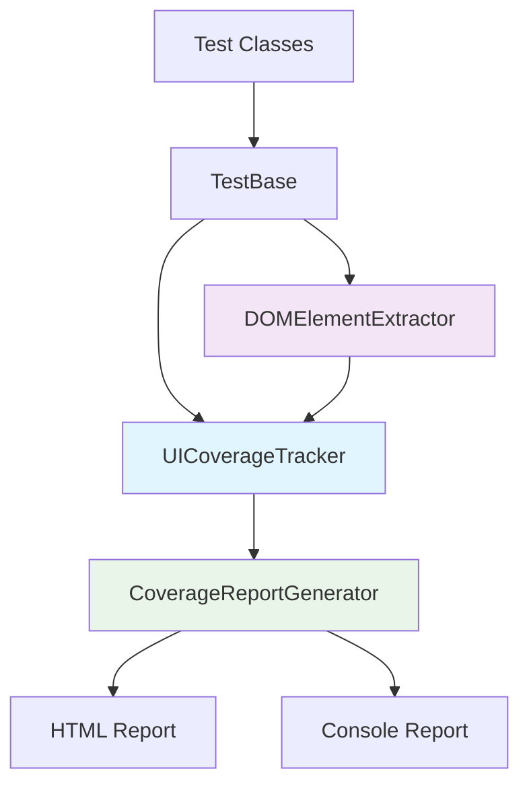

# 🎯 UI Coverage Tracker for Playwright

<div align="center">


**Интеллектуальная система отслеживания покрытия UI для автотестов на Playwright и Java**

[Особенности](#-особенности) • [Быстрый старт](#-быстрый-старт) • [Архитектура](#-архитектура)

</div>

## 🚀 Особенности

| Функция | Преимущество |
|---------|-------------|
| **📊 Автоматический сбор метрик** | Автоматически определяет какие элементы UI проверяются тестами |
| **🎨 Визуальные отчеты** | Генерирует интерактивные HTML отчеты с цветовой кодировкой |
| **🔍 Глубокий анализ DOM** | Собирает все интерактивные элементы страницы через JavaScript |
| **⚡ Интеграция с Playwright** | Работает поверх существующей инфраструктуры Playwright |
| **📈 Data-driven тестирование** | Помогает планировать разработку тестов на основе данных |
| **🔄 CI/CD готовность** | Легко интегрируется в пайплайны непрерывной интеграции |


## 🏗️ Архитектура



## ⚡ Быстрый старт
### Требования
Java 17+
Maven 3.6+
Playwright 1.50+

## Установка
Клонируйте проект:
`git clone https://github.com/AlgosStile/coverages.git
cd ui-coverage-tracker`

### Запустите демонстрационные тесты
`mvn test`

### Просмотрите отчет (путь к файлу например:)
`open target/ui-coverage-report.html`

## 📁 Структура проекта

```src/
├── main/java/
│   └── utils/
│       ├── UICoverageTracker.java      # 🎯 Ядро системы отслеживания
│       ├── DOMElementExtractor.java    # 🔍 Сборщик элементов UI
│       └── CoverageReportGenerator.java # 📊 Генератор отчетов
├── test/java/
│   ├── base/
│   │   └── TestBase.java               # 🏗️ Базовый класс тестов
│   └── tests/
│       └── WorkingTextBoxTest.java     # 🧪 Примеры тестов
```

## 🧩 Компоненты системы
### 🎯 UICoverageTracker
Цель: Единый источник для данных о покрытии

```java
// Пример использования
UICoverageTracker tracker = UICoverageTracker.getInstance();
tracker.addElement("button:submit");
tracker.markAsCovered("button:submit");
double coverage = tracker.getCoveragePercentage(); // 75.5%
```

### Особенности:

✅ Паттерн Singleton для единого состояния

✅ Thread-safe операции с Set коллекциями

✅ Автоматический расчет процента покрытия

### 🔍 DOMElementExtractor
Цель: Интеллектуальный сбор элементов интерфейса

`// Автоматически собирает все интерактивные элементы
domExtractor.collectAllInteractiveElements();`
Собирает:
🖱️ Кнопки, поля ввода, ссылки
🎯 Элементы с data-атрибутами
👁️ Только видимые элементы DOM

### 🏗️ TestBase
Цель: Базовый класс для наследования всеми тестами

```java
public class MyTest extends TestBase {
@Test
void myTest() {
navigateWithCoverage(url, "Page Name");     // ✅ Авто-сбор элементов
clickWithCoverage(selector, "Description"); // ✅ Отслеживание покрытия
fillWithCoverage(selector, value, "Field"); // ✅ Логирование действий
}
}
```

### 📊 CoverageReportGenerator
Цель: Создание профессиональных отчетов

Генерирует:
📈 Визуальные прогресс-бары
🎨 Цветовую кодировку элементов
📋 Детальные списки покрытых/непокрытых элементов
🧪 Пример использования

### Запуск и результаты

`mvn test`
#### Консольный вывод:
```
🌐 Navigating to: https:site.ru
✓ Collected 18 interactive elements
📊 Analyzing page: Login Page
✅ Filled: Username Field with: 'testuser'
✅ Filled: Password Field with: 'password123'  
✅ Clicked: Login Button
🎉 Test completed successfully!

=== UI COVERAGE REPORT ===
Total elements: 18
Covered elements: 6
Coverage: 33.33%
Uncovered elements: 12
```

### 📈 Генерация отчетов
#### HTML Отчет
После выполнения тестов автоматически генерируется: `target/ui-coverage-report.html:`

Содержание отчета:

📊 Сводная статистика покрытия

✅ Список покрытых элементов (зеленые)

❌ Список непокрытых элементов (красные)

📈 Визуальный прогресс-бар

🔧 Интеграция с CI/CD
GitHub Actions пример
```yaml
name: UI Tests with Coverage
on: [push, pull_request]

jobs:
test:
runs-on: ubuntu-latest
steps:
- uses: actions/checkout@v4
- name: Set up Java
uses: actions/setup-java@v3
with:
java-version: '17'
distribution: 'temurin'

      - name: Run tests with coverage
        run: mvn test
      
      - name: Upload coverage report
        uses: actions/upload-artifact@v3
        with:
          name: ui-coverage-report
          path: target/ui-coverage-report.html
```

Проверка качества покрытия
```java
// В пайплайне можно проверять минимальное покрытие
@AfterAll
public static void validateCoverage() {
double coverage = UICoverageTracker.getInstance().getCoveragePercentage();
if (coverage < 70.0) {
throw new AssertionError("UI coverage below minimum: " + coverage + "%");
}
}
```

### 🎯 Преимущества для команд
Для Automation QA
📊 Измеримое качество - точные метрики покрытия UI
🎯 Приоритизация - данные для планирования тестов
🔍 Слепые зоны - автоматическое обнаружение непроверенных элементов

### Для Разработчиков
🐛 Раннее обнаружение - проблемы выявляются до ручного тестирования
📈 Прогресс - визуализация улучшения покрытия
🔄 Регрессия - контроль за покрытием при изменениях

### Для Менеджмента
📋 Прозрачность - понятные отчеты о состоянии тестирования
💰 ROI - обоснование инвестиций в автоматизацию
🎯 Фокус - данные для принятия решений о приоритетах

## 📄 Лицензия
Этот проект распространяется под лицензией MIT. См. файл LICENSE для подробностей.